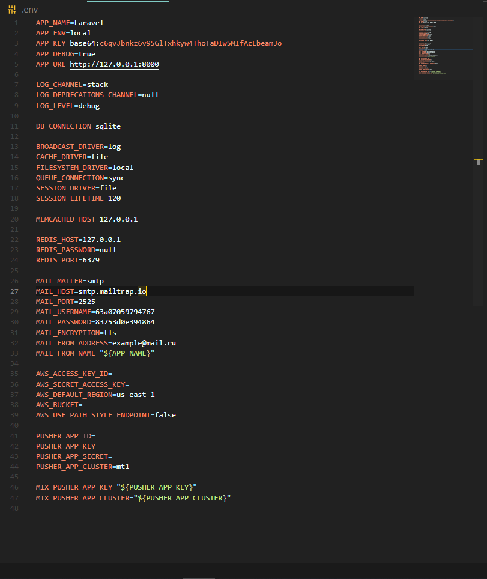
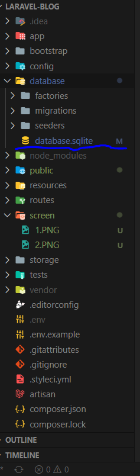
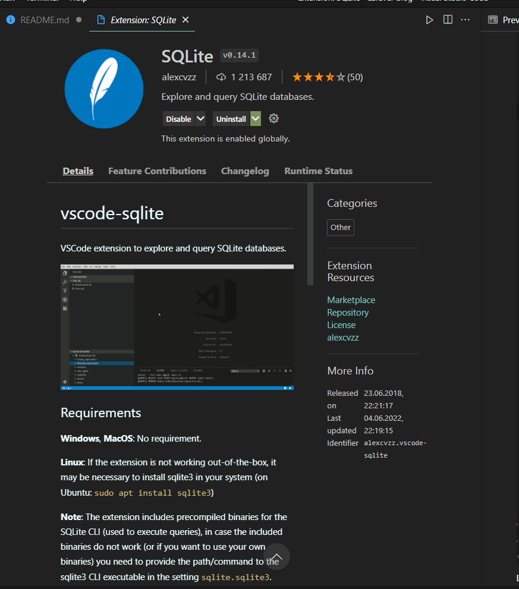
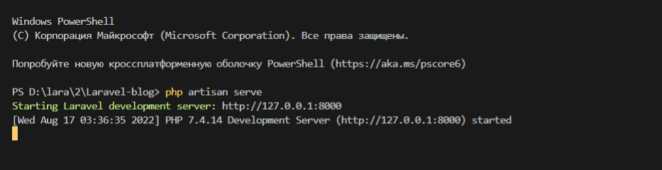
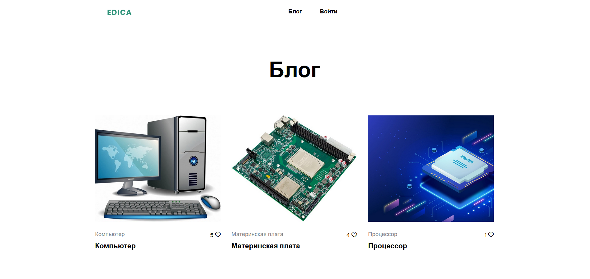
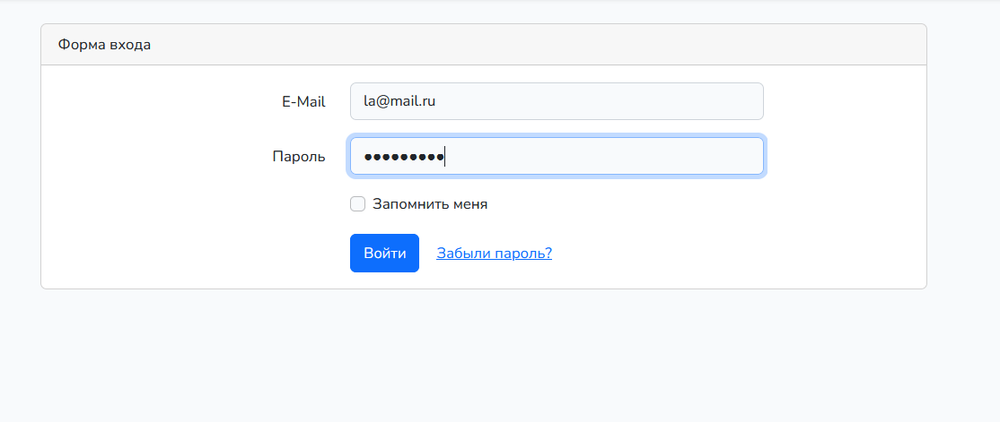
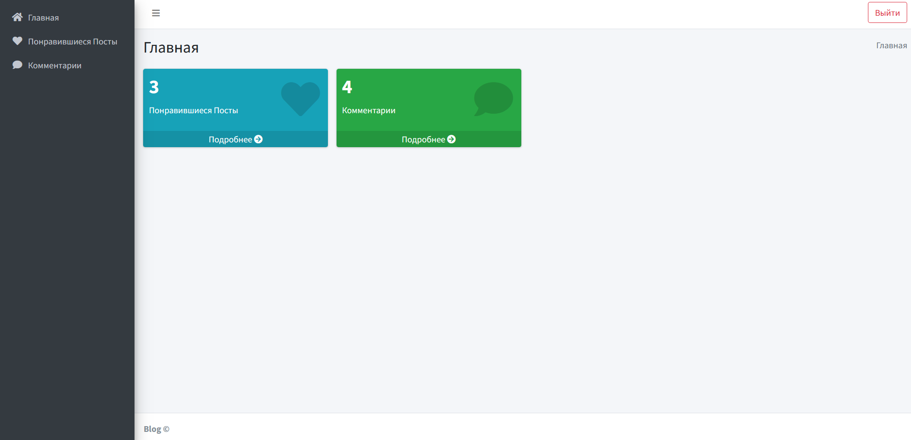
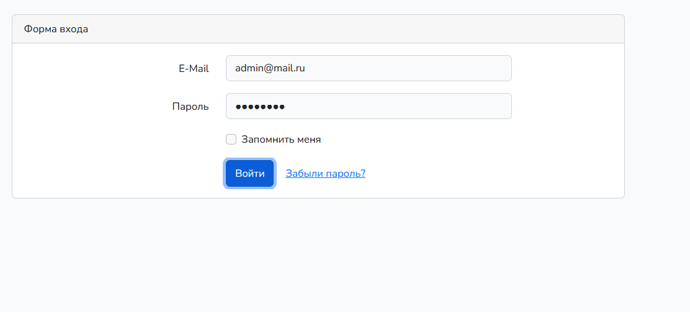
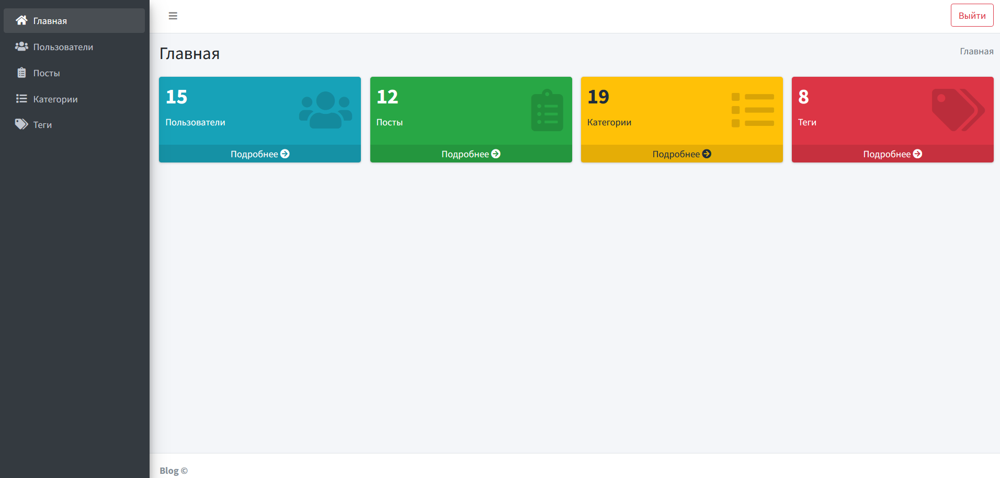

## Скачиваем проект
 
 А после прописываем ряд команд:
 >composer update

 >npm install

и копируем файл env.example (можно переименовать и убрать слова example )
на очереде выйдет 
.env

## После заходим в файл .env

в консоле прописываем 

>php artisan key:generate

для генерации ключа

меняем его прямо как на скрине

Токен не меняем не в коем случаи, оставляем токен, тот который сгенерировали!

## Далее импортим БД 

Устанавливем расширение и делаем все по документации

и запускаем миграции 

>php artisan migrate

Чтобы запустить проект пишите в консоль 
>php artisan serve

жмете на адрес и открываете

## Главная страница Блога

можно зайти в личные кабинет под тестовым аккаунтом

la@mail.ru 
12345678

Личный кабинет 

Можно войти через админа для этого нужно выйти, если вы авторизированы!

И пройти по 127.0.0.1:8000/admin/

и авторизоваться под: admin@mail.ru 12345678

## Админ Панель 

